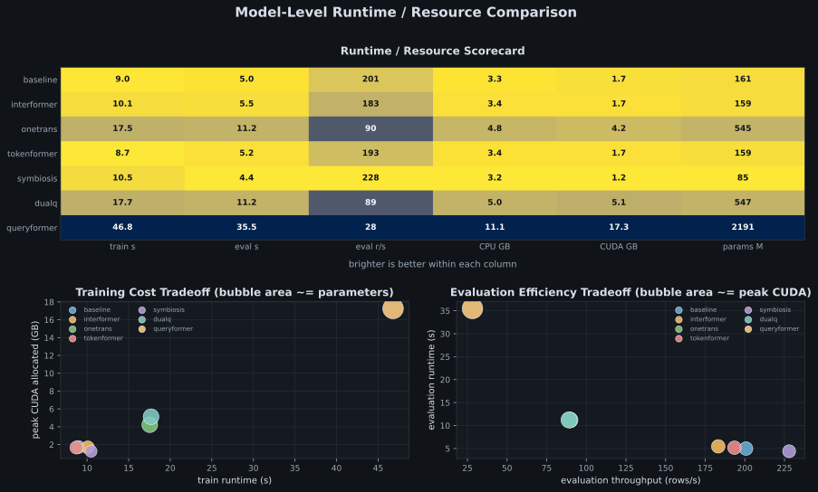
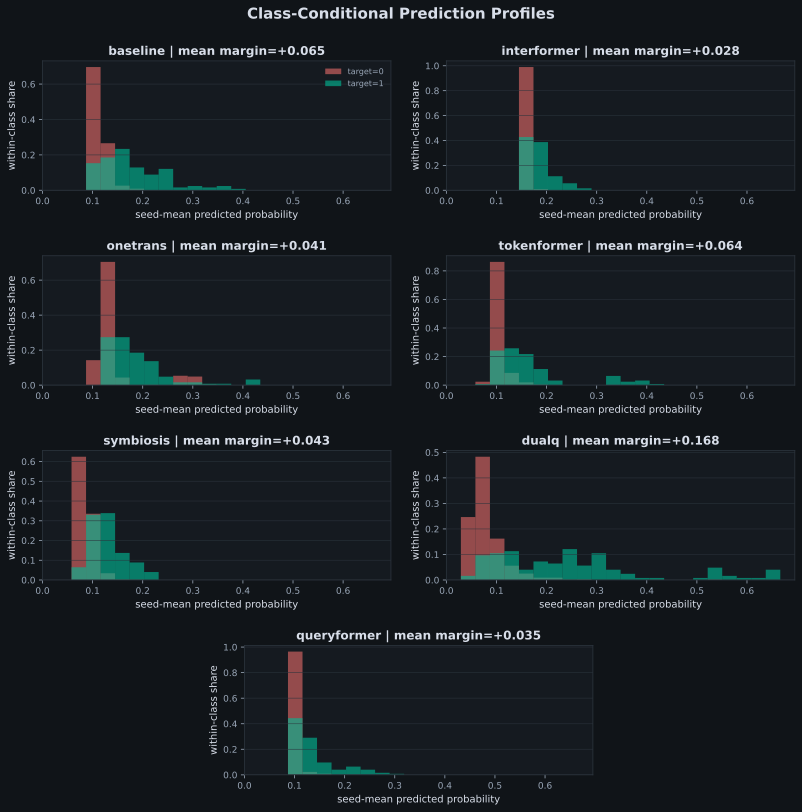
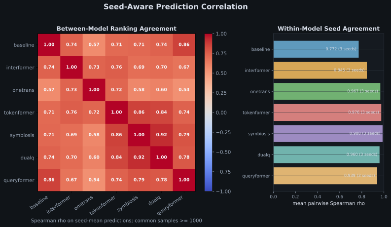
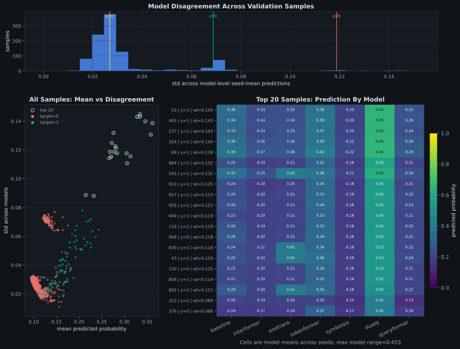
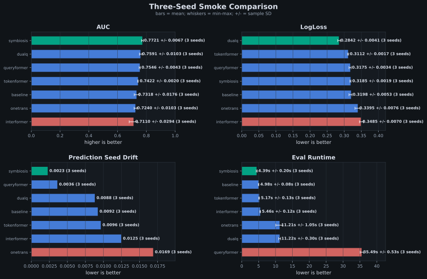

<h1 align="center">TAAC 2026 Experiment Workspace</h1>

<p align="center">
  <strong>迈向统一序列建模与特征交互的大规模推荐系统</strong>
</p>

<p align="center">
  <a href="https://github.com/Puiching-Memory/TAAC_2026/actions/workflows/ci.yml"></a>
  <a href="https://puiching-memory.github.io/TAAC_2026/"></a>
  
  
  
  
</p>

<p align="center">
  <a href="https://oosmetrics.com/repo/Puiching-Memory/TAAC_2026"></a>
</p>


<p align="center">
  <a href="https://algo.qq.com/#intro">Competition</a> ·
  <a href="docs/getting-started.md">Quick Start</a> ·
  <a href="docs/experiments/index.md">Experiments</a> ·
  <a href="https://puiching-memory.github.io/TAAC_2026/">Online Docs</a> ·
  <a href="#社区">QQ 群</a>
</p>

<p align="center">
  
</p>

> [!NOTE]
> 这是 TAAC 2026 其中一个参赛队伍的代码仓库，不代表官方文档。  
> 我们的目标是提供一个开箱即用、便于扩展和回归验证的实验工作区，  
> 以促进社区在统一序列建模与特征交互方向上的研究和创新。  
> 
> 比赛已正式结束，推荐关注的前排开源方案：  
> - [PixelCookie-zyf/TAAC-2026-SeRankMixer](https://github.com/PixelCookie-zyf/TAAC-2026-SeRankMixer)（学术赛道 Rank 9）  
> - [yuemingyue/2026-taac](https://github.com/yuemingyue/2026-taac)（学术赛道初赛 TOP9）  
> - [Lambert-vsziii/TAAC-2026-Tencent-KDD](https://github.com/Lambert-vsziii/TAAC-2026-Tencent-KDD)（HyFormer 增强，0.823689）  
> - [jbdcia321vw/TAAC-2026-SIGKDD-0.8316](https://github.com/jbdcia321vw/TAAC-2026-SIGKDD-0.8316)（HyFormer 增强，0.8316）  

## 比赛简介

推荐系统作为大规模内容平台（信息流、短视频等）与数字广告（点击率/转化率预估等）的核心引擎，直接决定了用户体验、参与度及平台商业收益。面对海量并发请求与严苛的实时响应约束，现代推荐系统每日需完成数十亿次在线决策，支撑起规模庞大的数字广告生态。  

过去二十年间，推荐技术主要沿两条路径演进：一是**特征交互模型**，专注于高维稀疏多域特征与上下文信号的深度交叉；二是**序列模型**，借助 Embedding 检索与 Transformer 架构捕捉用户行为的时序动态。尽管两条路线各自成果丰硕，但长期以来的割裂发展导致工业界系统面临结构性瓶颈：跨范式交互浅层化、优化目标不一致、扩展能力受限，以及日益攀升的硬件与工程复杂度。随着序列长度与模型参数的持续增长，这种碎片化架构的效率瓶颈愈发凸显。

近年来，学界与工业界开始探索融合这两大传统分支的统一建模范式 [1~3]。为加速该方向的突破，我们发起"**迈向统一序列建模与特征交互的大规模推荐系统**"挑战赛。我们鼓励参赛者设计统一的 Tokenization 方案与同质化、可堆叠的骨干网络，在单一架构内同时建模用户行为序列与非序列多域特征，完成转化率预估任务。  

参赛队伍将依据 ROC 曲线下面积（AUC）进行统一排名。除排行榜外，本次大赛特设两项创新奖——**统一模块创新奖**（45,000 美元）与**Scaling Law 创新奖**（45,000 美元），分别表彰在统一架构设计与系统性缩放规律探索方面的杰出工作。创新奖与排行榜名次独立评审，研讨会论文录用将重点考察方法在上述两个方向的新颖性与洞察力，而非单纯追求 AUC 指标。

------

## 我们的工作

<table>
<tr>
<td width="50%" valign="top">

**实验与模型**

- **两文件接入新模型** — `__init__.py` + `model.py` 即可挂载实验，钩子覆写只替换差异部分
- **8 个模型实验包一行切换** — Baseline、Baseline+、InterFormer、OneTrans、TokenFormer、UniRec、Symbiosis、RankUp 共享数据管线与评估流程
- **一键打包上线** — `taac-package-train` 产出 `code_package.zip`，平台契约校验确保线上线下一致

</td>
<td width="50%" valign="top">

**数据与训练**

- **Step 级流式管线** — Parquet 流式读取，5 种缓存策略，确定性种子全链路可复现
- **可组合数据增强** — 序列裁剪、域级 Dropout、特征 Mask，每步动态生效
- **一行切换 GPU 内核** — RMSNorm 提供 torch / Triton / TileLang 三后端；LayerNorm 提供 torch / Triton；FlashAttention 支持 torch / TileLang，后续路线图见 [Operator Roadmap](docs/benchmark/operator-roadmap.md)

</td>
</tr>
<tr>
<td valign="top">

**工程与质量**

- **CI 全覆盖** — lint + 单元 / 契约 / 集成 / 基准测试 + 文档构建
- **分层测试** — `tests/` 按 unit / contract / integration / benchmark / gpu 组织
- **工具脚本** — `tools/` 提供缓存清理、GitHub 维护等实用工具

</td>
<td valign="top">

**AI 辅助与文档**

- **5 个 Agent Skills** — 覆盖环境配置、实验集成、文档构建、平台 API 和容器清理
- **全站技术文档** — Zensical 构建，涵盖架构、实验、论文、指南与诊断，`zensical serve` 本地预览

</td>
</tr>
</table>











## 快速开始

### 安装环境

```bash
uv python install 3.10.20

# 本地训练 / 评估
uv sync --locked --extra cuda126

# 需要测试、lint 或本地文档站时
uv sync --locked --extra dev --extra cuda126
```

### 训练、评估和推理

```bash
# 训练 baseline
bash run.sh train --experiment experiments/baseline \
  --run-dir outputs/readme_baseline \
  --schema-path docs/archive/files/schema/sample_1000_raw.schema.json

# 评估训练输出目录中的 checkpoint
bash run.sh val --experiment experiments/baseline \
  --run-dir outputs/readme_baseline \
  --schema-path docs/archive/files/schema/sample_1000_raw.schema.json

# 生成 predictions.json
bash run.sh infer --experiment experiments/baseline \
  --checkpoint outputs/readme_baseline \
  --result-dir outputs/readme_infer \
  --schema-path docs/archive/files/schema/sample_1000_raw.schema.json
```

### 生成线上 Bundle

```bash
# 生成线上训练上传文件
uv run taac-package-train --experiment experiments/baseline \
  --output-dir outputs/bundles/baseline_training

# 生成线上推理上传文件
uv run taac-package-infer --experiment experiments/baseline \
  --output-dir outputs/bundles/baseline_inference

# 训练 Bundle 顶层输出: run.sh + code_package.zip
# 推理 Bundle 顶层输出: infer.py + code_package.zip
```

### 测试与文档

```bash
# 跑当前单元测试树
uv run pytest tests/unit -q

# 严格检查 docs 站点能否构建
uv run zensical build --strict

# 本地预览文档站
uv run zensical serve
```

### 入口速查

| 入口                                   | 当前用途                |
| -------------------------------------- | ----------------------- |
| `bash run.sh train`                    | 训练实验                |
| `bash run.sh val` / `bash run.sh eval` | 本地评估一个实验        |
| `bash run.sh infer`                    | 生成 `predictions.json` |
| `uv run taac-package-train`            | 打包训练 Bundle         |
| `uv run taac-package-infer`            | 打包推理 Bundle         |
| `uv run pytest tests/unit -q`          | 运行单元测试            |
| `uv run zensical serve`                | 启动本地文档站          |

## 当前支持实验包

| 实验包      | 目录                                                   | 公开来源                                                                                                      |
| ----------- | ------------------------------------------------------ | ------------------------------------------------------------------------------------------------------------- |
| Baseline    | [experiments/baseline](experiments/baseline)           | 官方 DHyFormer baseline                                                                                       |
| Baseline+   | [experiments/baseline_plus](experiments/baseline_plus) | HyFormer 增强训练 recipe：OPT cache、轻量增强、Muon 和 accelerator backend                                    |
| Symbiosis   | [experiments/symbiosis](experiments/symbiosis)         | 本仓库维护的比赛用融合实验模型                                                                                |
| RankUp      | [experiments/rankup](experiments/rankup)               | 高有效秩表征实验包，验证随机稀疏重组、多 embedding 和 effective-rank 诊断                                     |
| InterFormer | [experiments/interformer](experiments/interformer)     | [InterFormer paper](https://arxiv.org/abs/2411.09852)                                                         |
| OneTrans    | [experiments/onetrans](experiments/onetrans)           | [OneTrans paper](https://arxiv.org/abs/2510.26104)                                                            |
| TokenFormer | [experiments/tokenformer](experiments/tokenformer)     | BFTS 分层注意力与 NLIR 门控交互的统一 token-stream 实验包                                                     |
| UniRec      | [experiments/unirec](experiments/unirec)               | UniRec 融合实验包，将 Hybrid SiLU attention、MoT、target-aware interest 和 BlockAttnRes 接入共享 PCVR runtime |

------

## Timeline
1. Competition Begins - Mar.15, 2026 - 23:59:59 AOE - Releasing demo dataset
2. Global Registration - Mar.19 ~ Apr.23 - 23:59:59 AOE
3. First-round Competition - Apr.24 ~ May 23 - 23:59:59 AOE
4. Second-round Competition - May 25 ~ Jun.24 - 23:59:59 AOE
5. Winners Announcement - Jul.15, 2026 Winner Notification - Aug. 9, 2026 - Winner Public Announcement

## Our Eligibility
Academic Track

## Dataset&Task

> [!NOTE]
> 本次比赛发布的数据集经过完全匿名化处理，不反映腾讯广告平台的实际生产特性。  
> 所有稀疏特征均以匿名整数 ID 表示，稠密特征以固定长度浮点向量提供；官方不发布原始文本、图像、URL 或任何个人身份信息。

> [!IMPORTANT]
> **Update [2026.04.10]**: 示例数据集已更新为扁平列布局格式，特征名已重命名，新增序列特征。请参考最新的 `demo_1000.parquet` 和 HuggingFace 上的 README 获取最新 schema 详情。  
> 
> 本项目已经同步更新最新的数据格式

样例数据唯一公开来源: https://huggingface.co/datasets/TAAC2026/data_sample_1000

如需把样例 parquet 下载到本地目录，先安装环境后执行：

```bash
mkdir -p data/sample_1000_raw
uv run huggingface-cli download TAAC2026/data_sample_1000 \
  demo_1000.parquet \
  --repo-type dataset \
  --local-dir data/sample_1000_raw
```

本仓库没有提交 `demo_1000.parquet`。与样例数据对应的 schema 参考快照保存在：

```text
docs/archive/files/schema/sample_1000_raw.schema.json
```

如果某个旧脚本或 benchmark 需要 `data/sample_1000_raw/schema.json` 这种目录式布局，可以复制归档 schema：

```bash
cp docs/archive/files/schema/sample_1000_raw.schema.json data/sample_1000_raw/schema.json
```

官网披露的初赛数据集是一个基于真实广告日志构建的大规模工业级数据集，包含约 2 亿条用户序列。数据由两类核心信息组成：一类是用户与物品之间的行为序列，例如曝光、点击和转化，并附带时间戳、动作类型等上下文信息；另一类是非序列多字段特征，覆盖用户属性、物品属性、上下文信号和交叉特征。

当前样例数据采用扁平列布局（flat column layout）：所有特征都作为独立的顶级列存储在 Parquet 文件中，而不是嵌套结构。样例文件共 120 列，官网摘要如下：

| 特征分组       | 列数 | 数据形态                | 说明                                           |
| -------------- | ---- | ----------------------- | ---------------------------------------------- |
| ID 与标签      | 5    | `int64` / `int32`       | 核心标识、监督标签和时间戳                     |
| 用户整型特征   | 46   | `int64` / `list<int64>` | 单值或多值离散用户特征，描述用户属性与偏好     |
| 用户稠密特征   | 10   | `list<float>`           | 连续值用户特征，包含 embedding 与对齐统计信号  |
| 物品整型特征   | 14   | `int64` / `list<int64>` | 离散物品特征，包含类目、类型、基础信息与多标签 |
| 域行为序列特征 | 45   | `list<int64>`           | 来自 4 个行为域的用户行为序列特征              |

### 详细字段结构

**ID 与标签列（5 列）**

这 5 列均无空值：

| 字段 | `user_id` | `item_id` | `label_type` | `label_time` | `timestamp` |
| ---- | --------- | --------- | ------------ | ------------ | ----------- |
| 类型 | `int64`   | `int64`   | `int32`      | `int64`      | `int64`     |

**用户稠密特征（10 列）**

- `user_dense_feats_{61, 87}`：共 2 列，表示用户 embedding 特征（SUM、LMF4Ads）。
- `user_dense_feats_{62-66, 89-91}`：共 8 列，与 `user_int_feats_{62-66, 89-91}` 一一对应，数组长度保持一致；例如 `user_int_feats_62: [1, 2, 3]` 与 `user_dense_feats_62: [10.5, 20, 15.5]` 按元素对齐。

**物品整型特征（14 列）**

- `item_int_feats_{5-10, 12-13, 16, 81, 83-85}`：共 13 列，标量 `int64`。
- `item_int_feats_11`：共 1 列，数组 `list<int64>`。

**域行为序列特征（45 列）**

- `domain_a_seq_{38-46}`：9 列。
- `domain_b_seq_{67-79, 88}`：14 列。
- `domain_c_seq_{27-37, 47}`：12 列。
- `domain_d_seq_{17-26}`：10 列。

可以用示例样本快速查看当前字段：

```python
import pandas as pd
df = pd.read_parquet("demo_1000.parquet")
print(df.shape)       # (1000, 120)
print(df.columns)     # ['user_id', 'item_id', 'label_type', ...]
```

下载后可以保留如下本地布局，便于检查 schema 与维护脚本：

```text
data/sample_1000_raw/
├── demo_1000.parquet
└── schema.json  # 可由 docs/archive/files/schema/sample_1000_raw.schema.json 复制得到
```

补充说明：官方 `demo_1000.parquet` 当前只有 1 个 Row Group。本仓库支持这种样例文件，在 smoke 训练时会复用同一个 Row Group 做 train/valid 切分，仅用于通路验证，不代表有统计意义的离线验证。

## Evaluation
我们将使用单一的ROC曲线下面积（AUC）指标对所有团队进行排名（越高越好）。为确保实用性，每次提交还必须在官方评估环境和协议下满足特定于赛道和轮次的推理延迟限制；超出延迟预算的提交将被视为无效，因此不予排名，无论AUC分数如何。

为鼓励与我们主题一致的创新——构建一个统一模块，弥合序列建模与多字段特征交互之间的鸿沟，并探索推荐系统的缩放规律——我们还将提供两项创新奖：统一模块创新奖（45,000美元）和缩放规律创新奖（45,000美元）。这些奖项与排行榜排名无关。最终获奖决定将由委员会根据提交的技术报告、代码以及所提方法的新颖性和洞察力进行综合评审，特别是围绕本次比赛强调的两个方向，而非仅关注最终AUC分数。

## Rules
**评分标准**
比赛设有两条平行赛道，分别拥有独立的排行榜。  
学术赛道仅限团队成员全部隶属于大学或学院的队伍参加（如本科生、硕士生或博士生；需提供学术 affiliation 证明）。工业赛道则无资格限制，向所有参与者开放。为更好地反映部署约束，工业赛道将执行更严格的推理延迟限制。  
为强调方法论的清晰性并实现公平比较，我们禁止在整个比赛中使用模型集成。

比赛采用两阶段评估框架，逐步强调预测准确性、可扩展性、效率和可复现性。在第一轮（开放初赛阶段），所有团队将在隐藏测试集上根据官方评估指标进行排名，同时实施严格的防过拟合控制（如提交限制和延迟反馈）。如有必要，将实施容量感知滚动准入机制（支持多达5,000支并发团队），以确保公平的资源访问。第一轮结束时，排行榜将被冻结，前50名学术团队和前20名工业团队将仅根据官方指标表现晋级第二轮。
第二轮在约10倍更大规模的数据集上评估模型的鲁棒性和大规模建模能力，同时设置严格的推理延迟限制，以鼓励采用GPU高效统一架构。每支决赛团队将获得相当的计算资源，且所有提交必须通过官方环境中的可复现性和规则合规性验证。

## 社区

欢迎加入 TAAC2026(民间群) 交流训练、复现、实验管理和线上提交经验。QQ群：1098676137。


<a href="https://www.star-history.com/?repos=Puiching-Memory%2FTAAC_2026&type=date&legend=top-left">
 <picture>
   <source media="(prefers-color-scheme: dark)" srcset="https://api.star-history.com/chart?repos=Puiching-Memory/TAAC_2026&type=date&theme=dark&legend=top-left" />
   <source media="(prefers-color-scheme: light)" srcset="https://api.star-history.com/chart?repos=Puiching-Memory/TAAC_2026&type=date&legend=top-left" />
   
 </picture>
</a>

## 相关工作
以下按公开可访问资料整理，优先保留能直接借鉴代码、EDA、方法说明和赛事资料的链接，持续补充。比赛已正式结束，官方结果已于 2026-07-15 公布；赛后已有更多前排方案陆续开源，本段会随新仓库出现继续更新。
调查时间: 2026-07-04

**2026届：公开仓库 / 方案**  

### 高分单模型与赛后复盘
比赛结束后公开的代表性高分单模型与复盘仓库，README 通常包含完整提交记录、消融路径和checkpoint选择经验。
- [PixelCookie-zyf/TAAC-2026-SeRankMixer](https://github.com/PixelCookie-zyf/TAAC-2026-SeRankMixer) — 学术赛道 Rank 9，Test weighted-AUC 0.828814；单模型 RankMixer + DIN + group-wise bilinear fusion，Muon / SWA / SAM 训练。
- [yuemingyue/2026-taac](https://github.com/yuemingyue/2026-taac) — 学术赛道初赛 TOP9，AUC 0.833830；含最终提交配置与赛后复盘。
- [bwzhaocodes/TAAC-Tencent-2026](https://github.com/bwzhaocodes/TAAC-Tencent-2026) — 学术赛道初赛 30 名（单人队伍），AUC 0.833050；完整单兵方案与训练流程。
- [YodesYang/KDDCup2026-TencentAds-UniRec](https://github.com/YodesYang/KDDCup2026-TencentAds-UniRec) — 工业赛道 Rank 35/689（Top 5.1%），Public AUC 0.851365；含时间桶修正、public-tail 验证、点击/转化多任务目标、辅助验证窗口与终盘消融记录。
- [Rongfeng-Guo/Rank51-TAAC2026-KDDCUP](https://github.com/Rongfeng-Guo/Rank51-TAAC2026-KDDCUP) — 学术赛道 Rank 51，AUC 0.832321；含样本级/序列级周期时间特征、mean-DIN query pooling、UserDenseGroup、recent-window 训练与序列 hash embedding。
- [plus-w/TAAC-2026-KDD-Cup](https://github.com/plus-w/TAAC-2026-KDD-Cup) — 学术赛道 Rank 53/1873，Best Score 0.832309；前排方案细节与复盘。

### HyFormer 增强系列
均基于 PCVRHyFormer 基线渐进增强，覆盖 HashEmbedding、DIN Target Attention、DCN-v2 CrossNet、SE-Net 门控、时间编码、训练 recipe（AMP/EMA/cosine/pairwise loss）等方向，README 普遍含完整演进记录与消融实验。初赛分数范围 0.8237~0.8323。  
- [Lambert-vsziii/TAAC-2026-Tencent-KDD](https://github.com/Lambert-vsziii/TAAC-2026-Tencent-KDD) — `3673640` / 2026-05-18，初赛 0.823689。  
- [jbdcia321vw/TAAC-2026-SIGKDD-0.8316](https://github.com/jbdcia321vw/TAAC-2026-SIGKDD-0.8316) — `643fd43` / 2026-05-24  
- [bug-maker6/TAAC-2026](https://github.com/bug-maker6/TAAC-2026) — `7ce0fd4` / 2026-05-24  
- [VanillaCreamyy/TAAC2026---0.831174](https://github.com/VanillaCreamyy/TAAC2026---0.831174) — `afad21a` / 2026-05-25  
- [Giftia-0/TAAC-2026](https://github.com/Giftia-0/TAAC-2026) — 学术赛道 Rank 91/1873，AUC 0.831538，含赛后方案整理。  
- [LC-THU/TAAC2026-0.8311](https://github.com/LC-THU/TAAC2026-0.8311) — `6d4bdf5` / 2026-05-25  
- [Liaaaar/TAAC-KDD-Cup-2026-ACM-SIGKDD-0.831025-Solution](https://github.com/Liaaaar/TAAC-KDD-Cup-2026-ACM-SIGKDD-0.831025-Solution) — `ffbcd26` / 2026-05-24  
- [nhdzTVlxb/2026TAAC-KDD-CUP](https://github.com/nhdzTVlxb/2026TAAC-KDD-CUP) — 最终 0.83170，含 final-rank 截图（1v1 East Top6）。  
- [Dionysusfhs/TAAC2026_how_you_doing](https://github.com/Dionysusfhs/TAAC2026_how_you_doing) — `54917e3` / 2026-05-25，学术赛道 Rank 59/1876。  

### UniRec 统一序列方案
面向统一序列建模与特征交互的 UniRec 路线：统一 tokenizer + 可堆叠 backbone + hybrid attention mask，部分附带 scaling law 配置与显存优化。  
- [hojiahao/TAAC2026](https://github.com/hojiahao/TAAC2026) — `7a5bbcc` / 2026-04-27  
- [twx145/Unirec](https://github.com/twx145/Unirec) — `f14678f` / 2026-03-29  
- [lizuju/TAAC-2026](https://github.com/lizuju/TAAC-2026) — Public AUC 0.830964，`c480671` / 2026-05-24  
- [YodesYang/KDDCup2026-TencentAds-UniRec](https://github.com/YodesYang/KDDCup2026-TencentAds-UniRec) — `fe18a23` / 2026-05-24  

### PyTorch 架构复现系列
OneTrans / InterFormer / HyFormer 的非官方 PyTorch 复现与可运行训练脚手架，补齐 TAAC 样例数据张量化、AMP、激活检查点与 checkpoint 流程。  
- [WestbrookLong/OneTrans_Pytorch](https://github.com/WestbrookLong/OneTrans_Pytorch) — `8febd7e` / 2026-04-24  
- [WestbrookLong/Interformer_Pytorch](https://github.com/WestbrookLong/Interformer_Pytorch) — `6349126` / 2026-04-22  
- [WestbrookLong/Hyformer_Pytorch](https://github.com/WestbrookLong/Hyformer_Pytorch) — `8463549` / 2026-04-14  

### 工程工作区与底座
面向 TAAC 2026 的工程化底座与综合实验工作区，涵盖数据管线（Parquet/DuckDB）、多模型管理、bundle 打包、DDP 多卡训练等全链路能力。  
- [SCUcookie/TAAC2026](https://github.com/SCUcookie/TAAC2026) — `8fb366d` / 2026-05-23  
- [ChinaStark/taac_comp](https://github.com/ChinaStark/taac_comp) — `eaae182` / 2026-05-05  
- [ralgond/TAAC2026](https://github.com/ralgond/TAAC2026) — `4f96d68` / 2026-05-16  
- [XiaolongWang-c/tencent-ad](https://github.com/XiaolongWang-c/tencent-ad) — `15f60c2` / 2026-05-03  
- [lioliominister/TAAC2026](https://github.com/lioliominister/TAAC2026) — `6ace95a` / 2026-04-23  
- [Gray7118/taac2026-nzqk](https://github.com/Gray7118/taac2026-nzqk) — `6ac31f8` / 2026-05-10  
- [ZeroTrust01/KDD2026](https://github.com/ZeroTrust01/KDD2026) — `18a2b51` / 2026-03-30  

### Taiji CLI / Agent 工具
面向 Taiji 训练平台的 CLI 与自动化 Agent，覆盖训练任务管理、metrics 抓取、checkpoint 发布、评估提交与自主研究闭环。  
- [ZhongKuang/TAAC2026-CLI](https://github.com/ZhongKuang/TAAC2026-CLI) — `571d8b1` / 2026-05-09  
- [ucarcompany/TAAC2026-Agent-pro](https://github.com/ucarcompany/TAAC2026-Agent-pro) — `177ed28` / 2026-05-08  

### Baseline 实现与入门参考
面向快速入门与对照实验的 baseline 实现、教学仓库与模型校验工具，覆盖 HyFormer / OneTrans / DeepFM / DIN / DeepContextNet 等多种架构的本地可运行版本。  
- [AugustusXu/GenAdvRec](https://github.com/AugustusXu/GenAdvRec) — `96d1260` / 2026-04-27  
- [tobegold574/TAAC2026](https://github.com/tobegold574/TAAC2026) — `d4ccfac` / 2026-04-29  
- [wwWW-pig/TAAC2026_HyFormer](https://github.com/wwWW-pig/TAAC2026_HyFormer) — `9ffeb4f` / 2026-04-25  
- [Oka117/TAAC2026Baseline](https://github.com/Oka117/TAAC2026Baseline) — `99dce08` / 2026-04-28  
- [Lireswallow/2026TAAC-model-checker](https://github.com/Lireswallow/2026TAAC-model-checker) — `f6dc853` / 2026-04-26  
- [goldzzmj/TAAC-2026-AD-Baseline](https://github.com/goldzzmj/TAAC-2026-AD-Baseline) — `f2c77a7` / 2026-04-13  
- [creatorwyx/TAAC2026-CTR-Baseline](https://github.com/creatorwyx/TAAC2026-CTR-Baseline) — `e408db3` / 2026-03-20  
- [suyanli220/TAAC-2026-Baseline-Tencent-Advertisement-Contest](https://github.com/suyanli220/TAAC-2026-Baseline-Tencent-Advertisement-Contest) — `c91d492` / 2026-03-22  
- [Maxsim111/QinShiHuang-TAAC2026](https://github.com/Maxsim111/QinShiHuang-TAAC2026) — `6fe6887` / 2026-04-09  
- [wangjialin114/kdd-cup-2026-tencent](https://github.com/wangjialin114/kdd-cup-2026-tencent) — `50eb7d4` / 2026-04-02  
- [LingFeng-Liu-AI/KDD-Cup-TAAC2026-PolyRec](https://github.com/LingFeng-Liu-AI/KDD-Cup-TAAC2026-PolyRec) — `479cdd8` / 2026-05-24  
- [zhangzucheng/taac2026_rec_to_312](https://github.com/zhangzucheng/taac2026_rec_to_312) — `6b7735e` / 2026-05-24  

**2026届：Fork of [Puiching-Memory/TAAC_2026](https://github.com/Puiching-Memory/TAAC_2026)**  
以下为本仓库的 GitHub Fork 中有独立贡献的代表性项目（截至 2026-07-04，完整列表见 [Forks 页面](https://github.com/Puiching-Memory/TAAC_2026/forks))。  
- [LC1332/TAAC_2026-ref1](https://github.com/LC1332/TAAC_2026-ref1) 参考分支，星标 2，末次推送 2026-04-06。  
- [DMax1314/TAAC_2026](https://github.com/DMax1314/TAAC_2026) 星标 1，末次推送 2026-05-22，含 LayerNorm Triton 加速算子与归一化基础设施。  
- [flycalm/TAAC_2026](https://github.com/flycalm/TAAC_2026) 星标 1，末次推送 2026-04-11。  
- 其余 fork 汇总见 [GitHub Forks 页面](https://github.com/Puiching-Memory/TAAC_2026/forks)。  

**2026届：Kaggle / Notebook**  
- [galegale05/TAAC2026 Baseline v3 - Final](https://www.kaggle.com/code/galegale05/taac2026-baseline-v3-final/notebook) Kaggle 上公开的 HSTU 风格时间特征 baseline notebook，可作为时间 bucket、session 切分和轻量级序列建模的补充参考。  

**2026届：EDA / 资料入口**  
- [Strongdogking/TAAC_DI_Lab_EDA](https://github.com/Strongdogking/TAAC_DI_Lab_EDA) 针对公开 sample parquet 的 EDA 工作区，覆盖 label 分布、序列长度、feature 密度、建模建议与多份 agent 报告。末次 commit 快照: `6ee8741` / 2026-03-23 / `Add KDDCupEDA agent reports and README links`。  
- [https://huggingface.co/datasets/TAAC2026/data_sample_1000](https://huggingface.co/datasets/TAAC2026/data_sample_1000) 官方样例数据页面。  
- [https://algo.qq.com/#intro](https://algo.qq.com/#intro) 大赛主页。  

## References
```bibtex
@misc{interformer2025,
  author = {Zhichen Zeng and Xiaolong Liu and Mengyue Hang and Xiaoyi Liu and Qinghai Zhou and Chaofei Yang and Yiqun Liu and Yichen Ruan and Laming Chen and Yuxin Chen and Yujia Hao and Jiaqi Xu and Jade Nie and Xi Liu and Buyun Zhang and Wei Wen and Siyang Yuan and Hang Yin and Xin Zhang and Kai Wang and Wen-Yen Chen and Yiping Han and Huayu Li and Chunzhi Yang and Bo Long and Philip S. Yu and Hanghang Tong and Jiyan Yang},
  title = {InterFormer: Effective Heterogeneous Interaction Learning for Click-Through Rate Prediction},
  year = {2025},
  eprint = {2411.09852},
  archivePrefix = {arXiv},
  note = {CIKM 2025},
  doi = {10.48550/arXiv.2411.09852},
  url = {https://arxiv.org/abs/2411.09852},
}

@misc{onetrans2025,
  author = {Zhaoqi Zhang and Haolei Pei and Jun Guo and Tianyu Wang and Yufei Feng and Hui Sun and Shaowei Liu and Aixin Sun},
  title = {OneTrans: Unified Feature Interaction and Sequence Modeling with One Transformer in Industrial Recommender},
  year = {2025},
  eprint = {2510.26104},
  archivePrefix = {arXiv},
  note = {Accepted at The Web Conference 2026 (WWW 2026)},
  doi = {10.48550/arXiv.2510.26104},
  url = {https://arxiv.org/abs/2510.26104},
}

@misc{hyformer2026,
  author = {Yunwen Huang and Shiyong Hong and Xijun Xiao and Jinqiu Jin and Xuanyuan Luo and Zhe Wang and Zheng Chai and Shikang Wu and Yuchao Zheng and Jingjian Lin},
  title = {HyFormer: Revisiting the Roles of Sequence Modeling and Feature Interaction in CTR Prediction},
  year = {2026},
  eprint = {2601.12681},
  archivePrefix = {arXiv},
  note = {arXiv preprint},
  doi = {10.48550/arXiv.2601.12681},
  url = {https://arxiv.org/abs/2601.12681},
}
```
